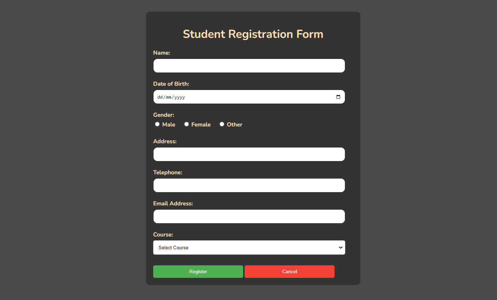
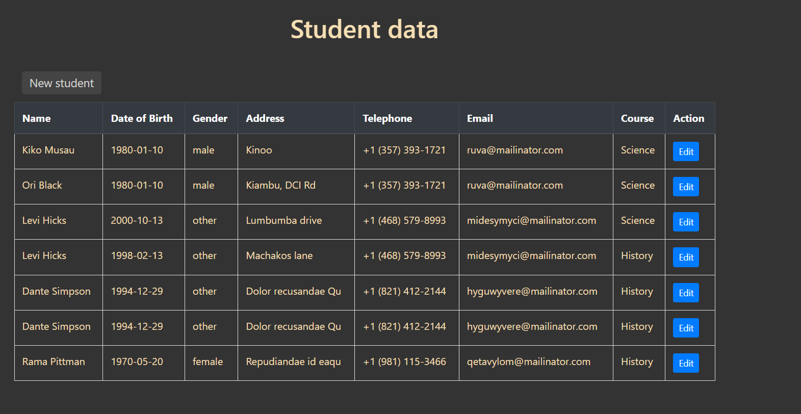

# Student Management System

This project is a simple student management system implemented using PHP, MySQL, and Bootstrap. It allows users to perform CRUD operations (Create, Read, Update, Delete) on student records.

## Features

- **Dashboard**: Displays a listing of student records.
- **Add New Student**: Allows users to add a new student record.
- **Edit Student**: Allows users to edit existing student records.
- **Delete Student**: Allows users to delete existing student records.

## Technologies Used

- PHP
- MySQL
- Bootstrap

## Screenshots

``Home``


``Dashboard``



## Setup

1. **Clone the Repository**:

    ```
    git clone https://github.com/your-username/student-management-system.git
    ```

2. **Database Configuration**:

    - Import the `reg_student.sql` file provided in the `database` directory to set up the necessary database and table structure.
    - Update the database connection details in the `config.php` file located in the `logic` directory.

3. **Run the Application**:

    - Ensure that your PHP server is running.
    - Navigate to the project directory in your browser to access the application.

## File Structure
```markdwon
student-management-system/
│
├── logic/ # Contains PHP logic files
│ ├── config.php # Database configuration file
│ ├── dashboard.php # Dashboard page to display student records
│ ├── add.php # Form to add new student
│ └── edit.php # Form to edit existing student
│
├── database/ # Contains SQL file for database setup
│ └── database.sql # SQL file to create database and table
│
├── README.md # Project README file
└── styles.css # Custom CSS styles
```


